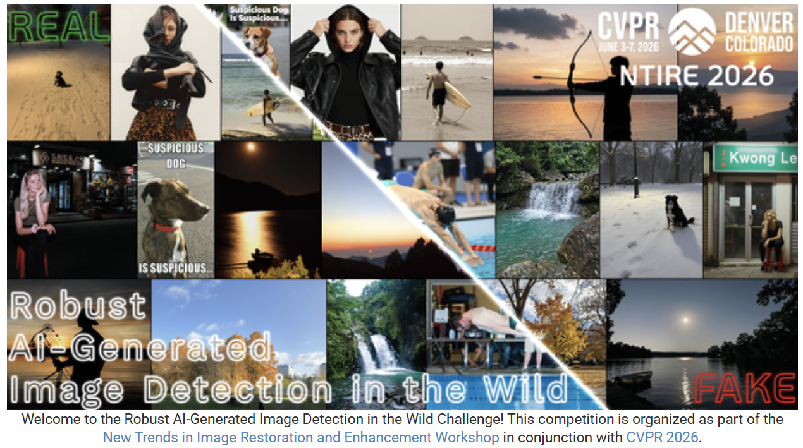

# FeatDistill

This repository is the UESTC solution for the **NTIRE 2026 Challenge on Robust AI‑Generated Image Detection in the Wild**, implemented via a four‑expert ensemble model.


The detector contains four independently trained experts:

| Expert | Vision encoder | Input | Classification head |
|---|---|---:|---|
| 1 | CLIP ViT-L/14 | 224 px | 768 → 256 → 2 |
| 2 | CLIP ViT-L/14 | 224 px | 768 → 256 → 2 |
| 3 | SigLIP So400M Patch14-384 | 384 px | 1152 → 256 → 2 |
| 4 | SigLIP So400M Patch14-384 | 384 px | 1152 → 256 → 2 |

## Repository Layout

```text
Featdistill_infer/
├─ infer/
│  ├─ model.py          # Model definitions, preprocessing, and strict loading
│  └─ cli.py            # Recursive, resumable batch inference
├─ distortion/           # Degradation operations that can be added during training
├─ weights/
│  ├─ README.md
├─ pyproject.toml
└─ requirements.txt
```

## Installation

Python 3.10 or newer is required. When using CUDA, install a PyTorch version compatible with your CUDA driver.

```bash
python -m venv .venv
python -m pip install --upgrade pip
python -m pip install -e .
```

## Checkpoints

Download the four released expert checkpoints and place them directly in `weights/`:

- Baidu Netdisk: [Download the shared `weights` folder](https://pan.baidu.com/s/1z4FfdeLJOu9PI0wks4vgqQ)
- Extraction code: `4dqe`

```text
weights/
├─ manifest.json
├─ Expert_1_clip.pth
├─ Expert_2_clip.pth
├─ Expert_3_siglip.pth
└─ Expert_4_siglip.pth
```

The following commands can be used to download the upstream models:

```bash
hf download openai/clip-vit-large-patch14 \
  --local-dir weights/clip-vit-large-patch14
hf download google/siglip-so400m-patch14-384 \
  --local-dir weights/siglip-so400m
```

The current `infer` package does not require these commands.

## Run Inference

```bash
python -m infer \
  --images-dir /path/to/images \
  --out-dir outputs/predictions \
  --weights-dir weights \
  --device auto
```

The command recursively reads JPEG, PNG, BMP, WebP, and TIFF images and writes:

- `predictions.csv`, containing the two columns `image_name,score`;
- `predictions.meta.json`, which binds the resumable CSV to its input root directory and weight manifest.

`image_name` is a POSIX-style path relative to `--images-dir`, so images in different subdirectories
do not conflict. `score` is the final fake-image probability in the range `[0,1]`. Running the same command again
resumes and continues processing unfinished images; use `--overwrite` to start over. During a resumed run,
do not replace input images with the same names; after the inputs change, use a new output directory or use
`--overwrite`. An exclusive output lock prevents two processes from appending to the same CSV simultaneously.

## Python API

```python
from PIL import Image
from infer import Model

model = Model(device="auto", model_data_dir="weights")
scores = model.predict_pil([Image.open("example.jpg")])
print(float(scores[0]))
```

`Model.predict()` also accepts a PyTorch tensor with shape `[B,3,H,W]`. Floating-point inputs must be finite
and within the range `[0,1]`; `uint8` tensors are also supported.

## Optional Degradation Utilities

The `distortion/` package is used for controlled robustness experiments and records the degradation operations used during method development. It is
intentionally kept separate from `Model` and the command-line interface: standard predictions always process the original decoded image and then perform only
deterministic resizing, center cropping, and normalization.

Install its additional numerical dependencies only when needed:

```bash
python -m pip install -e ".[distortion]"
```

Example:

```python
from distortion import apply_training_distortion

# image: a CPU float32 RGB tensor in [0,1] with shape [3,H,W]
degraded, operations, levels = apply_training_distortion(
    image,
    probability=0.8,
)
```

## Citation

Please cite the challenge report when using this implementation:

```bibtex
@inproceedings{gushchin2026ntire,
  title     = {NTIRE 2026 Challenge on Robust AI-Generated Image Detection in the Wild},
  author    = {Gushchin, Aleksandr and others},
  booktitle = {Proceedings of the IEEE/CVF Conference on Computer Vision and Pattern Recognition Workshops},
  pages     = {1895--1913},
  year      = {2026}
}
```

Paper: [arXiv:2604.11487](https://arxiv.org/abs/2604.11487) ·
[CVPR 2026 Open Access](https://openaccess.thecvf.com/CVPR2026_workshops/NTIRE).

## Release and Licensing Notes

- Add a `LICENSE` to the repository before making the code public. The appropriate license must be selected by the copyright holder.
- Review and disclose the upstream model terms and the distribution terms for the fine-tuned expert checkpoints before uploading the weights.
- This is a research detector. Model scores should not be treated as conclusive evidence about an image's origin.

